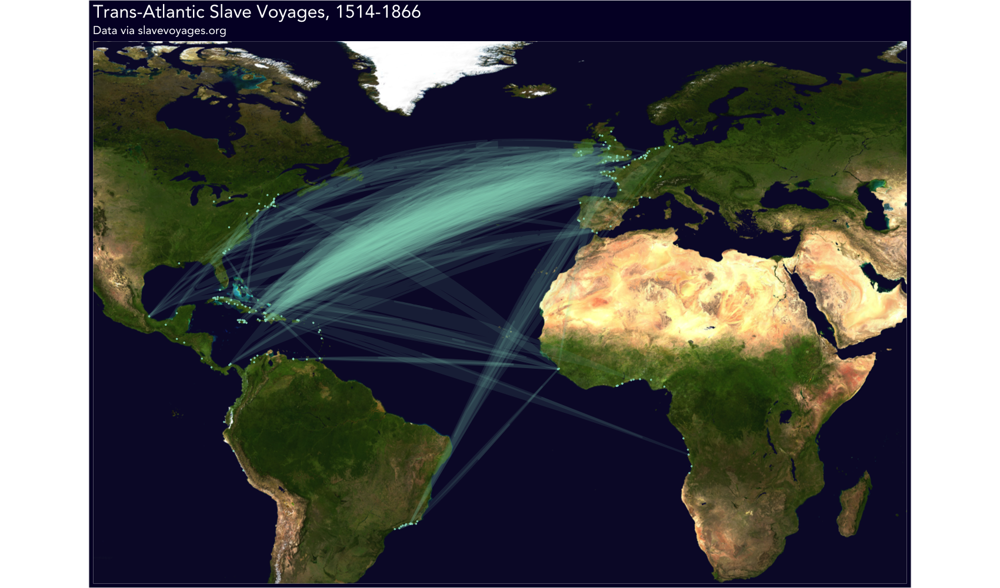
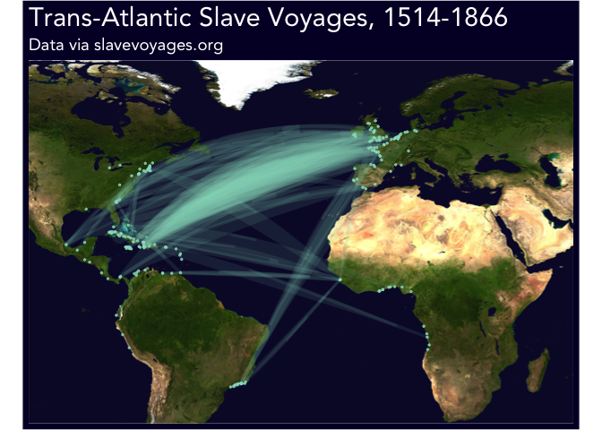

Tidy Tuesday 2020.06.16
================

This visualization is part of \#TidyTuesday, a weekly social data
project. Each week, a raw dataset is posted and users are invited to
explore, tidy, and visualize it. You can view past and current datasets
at
[github.com/rfordatascience/tidytuesday](https://github.com/rfordatascience/tidytuesday).

The June 16, 2020 data focused on American Slavery and Juneteenth, and
included datasets of slave routes, U.S. Census statistics by race from
1790-1990, names of enslaved Africans freed during forced transport, and
history of African America via Blackpast.org. I chose to focus on
visualizing the slave route data.

### Plot



Please note that this map provides only a partial visual for voyages.
The
[dataset](https://slavevoyages.org/voyage/about#methodology/coverage-of-the-slave-trade/1/en/)
only includes details for ~5 million enslaved Africans who arrived alive
at the final port, while it is suggested that more than 12.5 million
captives departed Africa. I was only able to match ~53% of voyages to
geolocation data for plotting, which translates to 1.6 million
individuals, about a third of `n_slaves_arrived`; this is an incomplete
and inexhaustive visualization of the trans-Atlantic slave trade and
should be considered a sample based on available data.

### Code

``` r
tuesdata <- tidytuesdayR::tt_load(2020, week = 25)
```

    ## --- Compiling #TidyTuesday Information for 2020-06-16 ----

    ## --- There are 4 files available ---

    ## --- Starting Download ---

    ## 
    ##  Downloading file 1 of 4: `census.csv`
    ##  Downloading file 2 of 4: `slave_routes.csv`
    ##  Downloading file 3 of 4: `african_names.csv`
    ##  Downloading file 4 of 4: `blackpast.csv`

    ## --- Download complete ---

``` r
slave_routes <- tuesdata$slave_routes

head(slave_routes)
```

    ## # A tibble: 6 x 8
    ##   voyage_id ship_name port_origin place_of_purcha… port_arrival year_arrival
    ##       <dbl> <chr>     <chr>       <chr>            <chr>               <dbl>
    ## 1     81711 Hannah    Liverpool   Calabar          St. Vincent…         1787
    ## 2     81712 Hannah    Liverpool   New Calabar      Grenada, po…         1789
    ## 3     81713 Hannah    Liverpool   Bight of Biafra… Kingston             1789
    ## 4     81714 Hannah    Liverpool   Bonny            St. Vincent…         1791
    ## 5     81715 Hannah    Liverpool   Congo River      Grenada, po…         1792
    ## 6     81716 Hannah    Liverpool   Ambriz           Kingston             1793
    ## # … with 2 more variables: n_slaves_arrived <dbl>, captains_name <chr>

The dataset includes more than 36,000 voyage records with port of
origin, port of arrival, place of purchase, ship and captain name, year
of arrival, and a count of enslaved peoples upon arrival. Since we will
be mapping routes, we can drop any voyages without ports of arrival (n =
4264 or 11%) and sub in place of purchase for voyages missing a port of
origin (n = 4199 or 11%). 265 records are missing both values and were
dropped (\<1%). Next, we isolate the unique port names and clean them
up, resulting in 439 unique ports.

``` r
# clean route df
# drop any routes without port of arrival
# sub in place of purchase for routes without port of origin 
slave_routes_clean <- slave_routes %>%
  mutate(start = case_when(!is.na(port_origin) ~ port_origin,
                           !is.na(place_of_purchase) ~ place_of_purchase,
                           TRUE ~ "missing"),
         end = port_arrival) %>%
  filter(!is.na(end) & start != 'missing') %>%
  select(voyage_id, year_arrival, n_slaves_arrived, start, end)

# identify unique ports
ports <- slave_routes_clean %>%
  pivot_longer(cols = c('start', 'end')) %>% 
  rename('name_original' = 'value') %>% 
  count(name_original, name = 'num_voyages', wt = n()) %>%
  mutate(name_1 = sapply(name_original, function(x) strsplit(x, ', | \\(|\\) ')[[1]][1]),
         name_2 = sapply(name_original, function(x) strsplit(x, ', | \\(|\\) ')[[1]][2]),
         name_clean = tolower(gsub('\\.', '', name_1))) %>%
  # quick manual edit
  mutate(name_clean = ifelse(name_clean == 'rhode island', 'providence', name_clean))

ports_unique <- ports %>%
  select(name_clean, num_voyages) %>%
  group_by(name_clean) %>% 
  summarise(num_voyages = sum(num_voyages, na.rm = TRUE)) %>%
  ungroup() %>%
  mutate(id = 1:n())

# add the id back to the original port names for future joining
ports <- ports %>%
  select(name_original, name_clean) %>%
  merge(select(ports_unique, name_clean, id, num_voyages), by = 'name_clean', all.x = TRUE)

ports_unique %>%
  arrange(desc(num_voyages)) %>%
  head()
```

    ## # A tibble: 6 x 3
    ##   name_clean     num_voyages    id
    ##   <chr>                <int> <int>
    ## 1 bahia                 8541    22
    ## 2 rio de janeiro        5344   333
    ## 3 liverpool             4478   215
    ## 4 london                2737   217
    ## 5 pernambuco            2630   297
    ## 6 barbados              2329    31

Next, to find latitude and longitude coordinates for each port, we will
join to a [Kaggle World Cities
dataset](https://www.kaggle.com/max-mind/world-cities-database/data).
The cities dataset is big, featuring more than 3.1 million locations. In
order to cut down on duplication (e.g. there are 27 cities named
“London” recorded in the data), we will restrict to [lat/long
boxes](https://boundingbox.klokantech.com/) focused around coasts of
interest (Western Africa, Europe, South America, Eastern U.S.,
Caribbean, etc.)

``` r
# https://www.kaggle.com/max-mind/world-cities-database/data
cities <- read.csv('worldcitiespop.csv')

# there are many cities matching each name since we don't have country to match on
# try restricting geographically to relevant coast lines 
# h/t https://boundingbox.klokantech.com/

lon_lat_boxes <- data.frame(desc = c("Caribbean", "Panama", "Gulf of Guinea", 
                                     "Western Africa", "Western Europe", 
                                     "Northeast US", "Mideast US", "Brazil",
                                     "Western South America"),
                            lat_upper = c(30, 18, 9, 35, 86, 45, 41, -22, 6),
                            lat_lower = c(13, 8, -36, 2, 34, 40, 32, -24, -16),
                            lon_upper = c(-65, -48, 16, 22, 10, -66, -79, -40, -77),
                            lon_lower = c(-98, -88, -15, 10, -12, -84, -88, -48, -88),
                            stringsAsFactors = FALSE)

bound_rectangles <- function(r){
  
  result <- cities %>% 
    filter(Longitude <= lon_lat_boxes$lon_upper[r] & Longitude >= lon_lat_boxes$lon_lower[r] & 
             Latitude <= lon_lat_boxes$lat_upper[r] & Latitude >= lon_lat_boxes$lat_lower[r])
  
  return(result)
  
}

# map_dfr cycles through the lon_lat_boxes criteria and rbinds them together, which may result in duplicates
# for overlapping lat/lon between the groups
cities_restricted <- purrr::map_dfr(1:nrow(lon_lat_boxes), bound_rectangles)
cities_restricted <- cities_restricted %>% unique() 

ports_geo <- ports_unique %>%
  merge(cities_restricted, by.x = 'name_clean', by.y = 'City', all.x = TRUE)

ports_geo %>% 
  arrange(desc(num_voyages)) %>%
  head()
```

    ##       name_clean num_voyages  id Country     AccentCity Region Population
    ## 1          bahia        8541  22      ec          Bahía     14         NA
    ## 2          bahia        8541  22      cu          Bahia     02         NA
    ## 3 rio de janeiro        5344 333      br Rio de Janeiro     21    6023742
    ## 4      liverpool        4478 215      us      Liverpool     AL         NA
    ## 5      liverpool        4478 215      us      Liverpool     NY         NA
    ## 6      liverpool        4478 215      gb      Liverpool     H8     468946
    ##    Latitude Longitude
    ## 1  -0.60000 -80.41667
    ## 2  23.13333 -82.30000
    ## 3 -22.90000 -43.23333
    ## 4  32.36667 -85.77833
    ## 5  43.10639 -76.21806
    ## 6  53.41667  -3.00000

While we were able to cut down the number of cities of interest from 3.1
million to ~565,000, there are still many records with multiple matches.
In order to move quickly, matching was determined to have the best
chance of accuracy by restricting to the city with the highest
population value. Unfortunately, not all cities have a population value
recorded, so many were dropped (72 out of 193, ~38%). 172 ports had no
city match (e.g. the value `???` or `africa`). 74 ports had one single
match, resulting in a total of 195 matches out of 439 unique port
values.

``` r
# still some multi-matches. Restrict to the city with the highest population.
# this will still result in some loss of data, as not all cities have a population value in the df.
ports_geo_dedupe <- ports_geo %>%
  group_by(name_clean, id) %>%
  mutate(duplicate = n() > 1) %>%
  # remove Ohio because it has a lot of cities causing weird overlaps
  filter(duplicate & !is.na(Population) & Region != 'OH') %>%
  mutate(max_population = max(Population, na.rm = TRUE)) %>%
  filter(Population == max_population) %>%
  ungroup() %>%
  select(-max_population)

ports_geo_clean <- ports_geo %>%
  # remove any ports that did not have a match
  filter(!is.na(Country)) %>%
  group_by(name_clean, id) %>%
  # remove any ports that were duplicated (they already exist in ports_geo_dedupe)
  mutate(duplicate = n() > 1) %>%
  filter(!duplicate) %>%
  # combine with ports_geo_dedupe
  bind_rows(ports_geo_dedupe) %>%
  select(name_clean, id, Latitude, Longitude)

# total voyages dropped?
voyage_status <- ports %>%
  merge(ports_geo_clean, by = 'id', all.x = TRUE) %>%
  mutate(is_missing = is.na(Latitude)) %>%
  group_by(is_missing) %>% 
  summarise(voyages = sum(num_voyages)) %>%
  ungroup() %>%
  mutate(pct = voyages/sum(voyages))

ports_geo_clean %>%
  head()
```

    ## # A tibble: 6 x 4
    ## # Groups:   name_clean, id [6]
    ##   name_clean     id Latitude Longitude
    ##   <chr>       <int>    <dbl>     <dbl>
    ## 1 accra           2     5.55    -0.217
    ## 2 ambriz          5    -7.84    13.1  
    ## 3 annotto bay    10    18.3    -76.8  
    ## 4 anomabu        11     5.17    -1.12 
    ## 5 azores         18    37.5     -2.57 
    ## 6 bacuranao      19    23.1    -82.2

Imperfect matching to lat/lon data resulted in matches for 39369 out of
75206 ports (2 per record with origin and arrival), or 0.5234822%.

Now we can merge the lat/lon data back into the route data.

``` r
# merge port ids with the route data
slave_routes_geo <- slave_routes_clean %>%
  merge(select(ports, name_original, id), by.x = 'start', by.y = 'name_original') %>%
  rename('start_id' = 'id') %>%
  merge(select(ports, name_original, id), by.x = 'end', by.y = 'name_original') %>%
  rename('end_id' = 'id')

slave_routes_geo_aggregated <- slave_routes_geo %>%
  select(-year_arrival, -voyage_id) %>%
  group_by(start_id, end_id) %>%
  summarise(num_voyages = n(),
            n_slaves_arrived = sum(n_slaves_arrived, na.rm = TRUE)) %>%
  ungroup() %>% 
  mutate(id = 1:n())

# merge lat lon with route data
slave_routes_geo_aggregated <- slave_routes_geo_aggregated %>%
  merge(ports_geo_clean, by.x = 'start_id', by.y = 'id') %>%
  rename('start_lat' = 'Latitude',
         'start_lon' = 'Longitude',
         'start_clean' = 'name_clean') %>%
  merge(ports_geo_clean, by.x = 'end_id', by.y = 'id') %>%
  rename('end_lat' = 'Latitude',
         'end_lon' = 'Longitude',
         'end_clean' = 'name_clean')

slave_routes_geo_aggregated %>%
  arrange(desc(n_slaves_arrived)) %>% 
  head(10)
```

    ##    end_id start_id num_voyages n_slaves_arrived   id    start_clean start_lat
    ## 1     333      333        1947           506787 1843 rio de janeiro -22.90000
    ## 2     196      215         922           269222 1161      liverpool  53.41667
    ## 3     196       58         312            78216  431        bristol  51.45000
    ## 4     196      217         256            68434 1264         london  51.51412
    ## 5     241      265         263            36996 1512         nantes  47.21651
    ## 6     309      265         151            35570 1518         nantes  47.21651
    ## 7      96      215         156            32440 1145      liverpool  53.41667
    ## 8     208      265         166            32248 1511         nantes  47.21651
    ## 9     257      215          90            27689 1169      liverpool  53.41667
    ## 10     96       58         167            24878  418        bristol  51.45000
    ##     start_lon      end_clean   end_lat   end_lon
    ## 1  -43.233333 rio de janeiro -22.90000 -43.23333
    ## 2   -3.000000       kingston  18.00000 -76.80000
    ## 3   -2.583333       kingston  18.00000 -76.80000
    ## 4   -0.093689       kingston  18.00000 -76.80000
    ## 5   -1.552379     martinique  19.81667 -72.53333
    ## 6   -1.552379 port-au-prince  18.53917 -72.33500
    ## 7   -3.000000     charleston  32.77639 -79.93111
    ## 8   -1.552379        leogane  18.51083 -72.63389
    ## 9   -3.000000    montego bay  18.46667 -77.91667
    ## 10  -2.583333     charleston  32.77639 -79.93111

Finally, load a jpeg for the map image, use `geosphere` to draw lines
between each pair of coordinates, and then use ggplot to draw the lines,
weighting them by number of voyages.

``` r
# h/t http://spatial.ly/2012/06/mapping-worlds-biggest-airlines/
download.file("https://earthobservatory.nasa.gov/blogs/elegantfigures/wp-content/uploads/sites/4/2011/10/land_shallow_topo_2011_8192.jpg",
              destfile = "land_shallow_topo_2011_8192.jpg", mode = "wb")
map <- jpeg::readJPEG("land_shallow_topo_2011_8192.jpg", native = TRUE)
map <- grid::rasterGrob(map, interpolate = TRUE)


slave_routes_geosphere <-  geosphere::gcIntermediate(p1 = slave_routes_geo_aggregated[ , c('start_lon', 'start_lat')],
                                    p2 = slave_routes_geo_aggregated[ , c('end_lon', 'end_lat')],
                                    n = 100,
                                    breakAtDateLine = FALSE,
                                    addStartEnd = TRUE,
                                    sp = TRUE)

slave_routes_fortified <- plyr::ldply(slave_routes_geosphere@lines, fortify)

# add back in num_voyages
slave_routes_fortified <- slave_routes_fortified %>%
  merge(select(slave_routes_geo_aggregated, id, num_voyages, n_slaves_arrived), by = 'id')

# plot
ggplot() +
  annotation_custom(map, xmin = -180, xmax = 180, ymin = -90, ymax = 90) +
  geom_path(aes(long, lat, group = id, size = n_slaves_arrived), alpha = 0.1, color = '#99DDC8', data = slave_routes_fortified) +
  geom_point(aes(Longitude, Latitude), size = 0.5, alpha = 0.75, color = '#99DDC8', data = ports_geo_clean) +
  labs(title = 'Trans-Atlantic Slave Voyages, 1514-1866',
       subtitle = 'Data via slavevoyages.org') +
  ylim(c(-30,70)) +
  xlim(c(-100,50)) + 
  theme(plot.background = element_rect(fill = '#04032F'),
        panel.background = element_rect(fill = '#FFFFFF', colour = '#FFFFFF'), 
        panel.grid.major = element_blank(),
        panel.grid.minor = element_blank(), 
        plot.title = element_text(color = '#FFFFFF', family = 'Avenir', size = 22),
        plot.subtitle = element_text(color = '#FFFFFF', family = 'Avenir', size = 14),
        axis.title = element_blank(), 
        axis.text = element_blank(), 
        axis.ticks.length = unit(0, 'cm'),
        legend.position = 'none') +
  coord_equal()
```

<!-- -->

``` r
ggsave('tidytuesday_slave_routes.png', width = 17, height = 10, units = 'in', dpi = 100)
```
