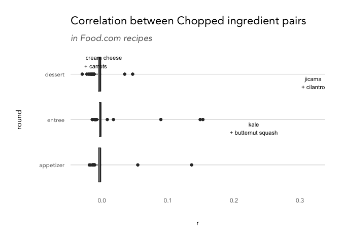

Tidy Tuesday 2020.08.25 - Chopped
================

This week’s [Tidy
Tuesday](https://github.com/rfordatascience/tidytuesday/blob/master/data/2020/2020-08-25/readme.md)
data is all about the cooking competition TV show Chopped. It includes
information about each episode’s rating, air date, name, judges,
contestants, and basket ingredients. The show is split into three rounds
(appetizer, entree, and dessert) where contestants are challenged to
create a dish using mystery basket ingredients. They may use any other
multitude of ingredients in the Chopped kitchen, but are expected to
highlight the basket ingredients. Judges review the dishes and “chop”
(eliminate) one chef from the competition.

The basket ingredients are often odd pairings - such as ground beef,
wonton wrappers, cream of mushroom soup, and bananas (an actual
appetizer round basket from episode 4). It made me wonder how often
these ingredients appear together in real life. I used a [recipe dataset
from
Kaggle](https://www.kaggle.com/shuyangli94/food-com-recipes-and-user-interactions?select=RAW_recipes.csv)
that includes thousands of recipes from Food.com to find out. Then, I
extrapolated that information to create a **Chopped Basket Generator**
where the selected ingredients are appropriately (un-)correlated.

Some choice generated baskets include:

  - “Open your baskets\! Your appetizer round ingredients are: peanut
    butter, parmigiano-reggiano cheese, apricots in juice, and fresh
    oregano.”  
  - “Open your baskets\! Your entree round ingredients are: turkey, cool
    whip topping, ravioli, and apple pie filling.”  
  - “Open your baskets\! Your dessert round ingredients are: buttermilk,
    frozen hash brown potatoes, oyster sauce, and molasses.”

-----

First, let’s load in the data and convert it from a string list to a
long format, where each ingredient and series episode number has its own
row. At the same time, let’s create a dataframe where each basket’s
ingredients are paired together to allow for easier comparison down the
road. I did this by double unnesting the same column, which feels pretty
hacky, but accomplished what I needed.

``` r
chopped <- tidytuesdayR::tt_load('2020-08-25')$chopped
```

    ## 
    ##  Downloading file 1 of 1: `chopped.tsv`

``` r
chopped %>% select(series_episode, appetizer) %>% head(1)
```

    ## # A tibble: 1 x 2
    ##   series_episode appetizer                                           
    ##            <dbl> <chr>                                               
    ## 1              1 baby octopus, bok choy, oyster sauce, smoked paprika

``` r
chopped_lists <- chopped %>%
  select(series_episode, appetizer, entree, dessert) %>%
  mutate(appetizer = sapply(appetizer, function(x) strsplit(x, ', ')[[1]]),
         entree = sapply(entree, function(x) strsplit(x, ', ')[[1]]),
         dessert = sapply(dessert, function(x) strsplit(x, ', ')[[1]]))

chopped_lists %>% head(1)
```

    ## # A tibble: 1 x 4
    ##   series_episode appetizer    entree       dessert     
    ##            <dbl> <named list> <named list> <named list>
    ## 1              1 <chr [4]>    <chr [4]>    <chr [3]>

``` r
chopped_ingredients_paired <- NULL

for(x in c('appetizer', 'entree', 'dessert')) {
  
  temp <- chopped_lists %>%
    select(series_episode, !!sym(x)) %>%
    mutate(round = x,
           ingredient = !!sym(x),
           ingredient2 = !!sym(x)) %>%
    unnest(ingredient) %>%
    unnest(ingredient2) %>%
    select(-!!sym(x)) %>%
    filter(ingredient != ingredient2) %>%
    mutate(ingredient = tolower(gsub("\\s*\\([^\\)]+\\)","",ingredient)),
           ingredient2 = tolower(gsub("\\s*\\([^\\)]+\\)","",ingredient2)))
  
  chopped_ingredients_paired <- chopped_ingredients_paired %>%
    bind_rows(temp)
  
}

chopped_ingredients_episodes <- chopped_ingredients_paired %>%
  select(-ingredient2) %>%
  unique()

chopped_ingredients <- chopped_ingredients_episodes %>%
  count(ingredient, name = 'chopped_count') 

chopped_ingredients_episodes %>%
  filter(series_episode == 1, round == 'appetizer')
```

    ## # A tibble: 4 x 3
    ##   series_episode round     ingredient    
    ##            <dbl> <chr>     <chr>         
    ## 1              1 appetizer baby octopus  
    ## 2              1 appetizer bok choy      
    ## 3              1 appetizer oyster sauce  
    ## 4              1 appetizer smoked paprika

``` r
chopped_ingredients_paired %>% 
  filter(series_episode == 1, round == 'appetizer')
```

    ## # A tibble: 12 x 4
    ##    series_episode round     ingredient     ingredient2   
    ##             <dbl> <chr>     <chr>          <chr>         
    ##  1              1 appetizer baby octopus   bok choy      
    ##  2              1 appetizer baby octopus   oyster sauce  
    ##  3              1 appetizer baby octopus   smoked paprika
    ##  4              1 appetizer bok choy       baby octopus  
    ##  5              1 appetizer bok choy       oyster sauce  
    ##  6              1 appetizer bok choy       smoked paprika
    ##  7              1 appetizer oyster sauce   baby octopus  
    ##  8              1 appetizer oyster sauce   bok choy      
    ##  9              1 appetizer oyster sauce   smoked paprika
    ## 10              1 appetizer smoked paprika baby octopus  
    ## 11              1 appetizer smoked paprika bok choy      
    ## 12              1 appetizer smoked paprika oyster sauce

Next, read in the first 10,000 rows from the recipe dataset. While all 2
million would be nice, we will ultimately take a sample of recipes
anyway to keep our correlation matrix a decent size for this quick
analysis. Finally, use the handy `stretch` function from `corrr` to turn
the correlation matrix into a long, tidy dataframe where each pair of
ingredients has a
row.

``` r
# https://www.kaggle.com/shuyangli94/food-com-recipes-and-user-interactions?select=RAW_recipes.csv
recipes_raw <- read.csv('RAW_recipes.csv', nrows = 10000)

recipes_raw %>% select(name, id, ingredients) %>% head(1)
```

    ##                                         name     id
    ## 1 arriba   baked winter squash mexican style 137739
    ##                                                                                     ingredients
    ## 1 ['winter squash', 'mexican seasoning', 'mixed spice', 'honey', 'butter', 'olive oil', 'salt']

``` r
recipes <- recipes_raw %>%
  select(id, ingredients) %>%
  mutate(ingredients = gsub("\\[|\\]|\\'", '', gsub('"', '', as.character(ingredients))),
         ingredient = sapply(ingredients, function(x) strsplit(x, ', ')[[1]])) %>%
  unnest(cols = ingredient) %>%
  mutate(ingredient = tolower(ingredient)) %>%
  select(-ingredients)

recipes %>% filter(id == 137739)
```

    ## # A tibble: 7 x 2
    ##       id ingredient       
    ##    <int> <chr>            
    ## 1 137739 winter squash    
    ## 2 137739 mexican seasoning
    ## 3 137739 mixed spice      
    ## 4 137739 honey            
    ## 5 137739 butter           
    ## 6 137739 olive oil        
    ## 7 137739 salt

``` r
recipe_ingredient_count <- recipes %>%
  count(ingredient, name = 'recipe_count') %>%
  left_join(chopped_ingredients, by = 'ingredient') %>%
  mutate(frequency = recipe_count/nrow(recipes_raw),
         chopped_ingredient = !is.na(chopped_count))

# 86% of recipes have at least one chopped ingredient
recipes_focus <- recipes %>%
  mutate(chopped_ingredient = ingredient %in% chopped_ingredients$ingredient) %>%
  group_by(id) %>%
  summarise(chopped_flag = any(chopped_ingredient), .groups = 'drop') %>%
  filter(chopped_flag) %>% # keep just recipes including chopped ingredients
  sample_n(size = 1000) # sample down to a reasonable size for computing correlation
  
recipes_wide <- recipes %>%
  filter(id %in% recipes_focus$id) %>% 
  count(id, ingredient) %>%
  pivot_wider(id_cols = 'id', names_from = 'ingredient', values_from = 'n') %>%
  mutate_if(is.numeric, replace_na, 0)

recipes_cor <- recipes_wide %>% 
  select(-id) %>% 
  corrr::correlate(use = 'pairwise.complete.obs', quiet = TRUE)

recipes_cor_long <- corrr::stretch(recipes_cor, na.rm = TRUE) %>%
  left_join(select(recipe_ingredient_count, ingredient, frequency), by = c('x' = 'ingredient')) %>% # add in frequency counts
  left_join(select(recipe_ingredient_count, ingredient, frequency), by = c('y' = 'ingredient')) 
```

From here, we can fill in the dataframe we created earlier containing
pairs of Chopped basket ingredients with their correlation value from
the Food.com dataset. This represents how often these ingredients occur
together in the “real” world - not on Chopped.

``` r
chopped_ingredients_paired_r <- chopped_ingredients_paired %>%
  left_join(recipes_cor_long, by = c('ingredient' = 'x', 'ingredient2'= 'y')) 

chopped_ingredients_paired_r %>%
  filter(ingredient == 'bok choy' & !is.na(r)) %>%
  head(10) %>%
  arrange(r)
```

    ## # A tibble: 5 x 7
    ##   series_episode round   ingredient ingredient2        r frequency.x frequency.y
    ##            <dbl> <chr>   <chr>      <chr>          <dbl>       <dbl>       <dbl>
    ## 1            305 entree  bok choy   dates       -0.00376      0.0014    0.0045  
    ## 2            305 entree  bok choy   coconut mi… -0.00348      0.0014    0.0046  
    ## 3              1 appeti… bok choy   oyster sau… -0.00284      0.0014    0.0031  
    ## 4              1 appeti… bok choy   smoked pap… -0.00142      0.0014    0.0014  
    ## 5            305 entree  bok choy   lamb shoul… -0.00142      0.0014    0.000300

The two metrics of most interest are how correlated basket ingredients
are with each other, as well as how common they are in the Food.com
recipes. Chopped baskets tend to have some more obscure ingredients to
make the challenge harder (such as tamarind paste or ladyfingers), so we
want to approximate that in our generator as well.

``` r
chopped_ingredients_paired_r %>%
  filter(!is.na(r)) %>% 
  mutate(round = factor(round, levels = c('appetizer', 'entree', 'dessert'))) %>%
  ggplot(aes(x = round, y = r)) + 
  geom_boxplot() +
  annotate('text', x = 3, y = 0.32, vjust = 1.2, cex = 3,
           label = 'jicama\n+ cilantro') +
  annotate('text', x = 2, y = 0.23, vjust = 1.2, cex = 3,
           label = 'kale\n+ butternut squash') +
  annotate('text', x = 3, y = -0.03, vjust = -0.5, hjust = -0.1, cex = 3,
           label = 'cream cheese\n+ carrots') +
  coord_flip() +
  labs(title = 'Correlation between Chopped ingredient pairs',
       subtitle = 'in Food.com recipes')
```

<!-- -->

Ingredients tend to have low correlation values - around 0 or slightly
under - but there have been a few lobs in Chopped history (such as the
entree round in episode 4 with `country pork ribs, kale, butternut
squash, and popcorn on the cob`). Of course, these are just pairwise
correlations, so the entire basket isn’t taken into account. There could
be a pair of nicely correlated ingredients along with two totally out of
left field - like in episode 88, where the appetizer round featured
`carrots, edamame, buffalo hot dogs, and butterscotch candy`.

``` r
chopped_ingredients_paired_r %>%
  filter(!is.na(frequency.x)) %>%
  select(series_episode, round, ingredient, frequency.x) %>% 
  unique() %>% 
  mutate(round = factor(round, levels = c('appetizer', 'entree', 'dessert'))) %>%
  ggplot(aes(x = round, y = frequency.x)) + 
  geom_boxplot() +
  annotate('text', x = 3, y = 0.108, vjust = 1.3,  cex = 3, label = 'milk') +
  annotate('text', x = 2, y = 0.05, vjust = 1.3,  cex = 3, label = 'honey') +
  annotate('text', x = 1, y = 0.04, vjust = 1.3,  cex = 3, label = 'tomatoes') +
  coord_flip() +
  labs(title = 'Frequency of Chopped ingredients',
       subtitle = 'in Food.com recipes',
       y = '% of Food.com recipes')
```

<!-- -->

Chopped ingredients tend to be more rare in the dataset, but the
distribution is right-skewed and long tailed, meaning that most
ingredients are “rare.” For example, mead is a really low-occuring
ingredient from a Chopped basket - but so are sour mix and lima beans.
In order to guide the generator, let’s calculate the average association
and frequency in of Chopped ingredients in the Food.com data:

``` r
# so the average similarity and rarity is...
chopped_parameters <- chopped_ingredients_paired_r %>% 
  mutate(round = factor(round, levels = c('appetizer', 'entree', 'dessert'))) %>%
  group_by(round) %>%
  summarise(mean_r = mean(r, na.rm = TRUE),
            sd_r = sd(r, na.rm = TRUE),
            mean_freq = mean(frequency.x, na.rm = TRUE),
            sd_freq = sd(frequency.x, na.rm = TRUE)) %>%
  ungroup() %>%
  mutate(lo_r = mean_r - sd_r,
         hi_r = mean_r + sd_r,
         lo_freq = mean_freq - sd_freq,
         hi_freq = mean_freq + sd_freq)

chopped_parameters
```

    ## # A tibble: 3 x 9
    ##   round        mean_r    sd_r mean_freq sd_freq    lo_r    hi_r  lo_freq hi_freq
    ##   <fct>         <dbl>   <dbl>     <dbl>   <dbl>   <dbl>   <dbl>    <dbl>   <dbl>
    ## 1 appetizer -0.00242  0.0153    0.00512 0.00757 -0.0177 0.0129  -0.00246  0.0127
    ## 2 entree     0.000978 0.0233    0.00424 0.00714 -0.0223 0.0243  -0.00290  0.0114
    ## 3 dessert   -0.00400  0.00625   0.00614 0.0111  -0.0102 0.00225 -0.00496  0.0172

And then create a function to generate baskets. It’s set up to start
with a random Chopped ingredient from the selected round (for some
Chopped-specific flavor). From there, it looks for ingredients in the
Food.com data that match the frequency parameters we set, and that have
correlation coefficients within the correlation parameters, and then
takes one randomly. Basically, it looks for a rare enough and
similar/dissimilar enough ingredient to the one before. Rinse and repeat
3 times and we have a basket of four weirdly paired ingredients\!

``` r
generate_chopped_ingredients <- function(input_round) { 

  if (input_round == 'surprise') {
    
    input_round <- sample(c('appetizer', 'entree', 'dessert'), size = 1)
    
  } else if (!input_round %in% c('appetizer', 'entree', 'dessert')) {
    
    return ('Invalid input round.')
    
  }
  
  parameters <- chopped_parameters %>% 
    filter(round == input_round)
  
  first_ingredient <- chopped_ingredients_paired_r %>%
    filter(!is.na(r)) %>%
    count(round, ingredient) %>%
    filter(round == input_round) %>%
    sample_n(size = 1)
  
  generated_ingredients <- c(first_ingredient$ingredient)
  
  for(i in 2:4) {
    
    temp <- recipes_cor_long %>%
      filter(x == generated_ingredients[i-1],
           r > parameters$lo_r[1],
           r < parameters$hi_r[1],
           frequency.y > parameters$lo_freq[1],
           frequency.y < parameters$hi_freq[1]) %>%
      sample_n(size = 1)
    
    generated_ingredients <- c(generated_ingredients, temp$y)
    
  }

  paste0('Open your baskets! Your ', input_round, ' round ingredients are: ', 
           paste(generated_ingredients[1:3], collapse = ', '), ', and ', generated_ingredients[4], '.')
  
}
```

Let’s test it
    out.

``` r
generate_chopped_ingredients(input_round = 'appetizer')
```

    ## [1] "Open your baskets! Your appetizer round ingredients are: peanut butter, dark vegetable stock powder, roasted peanuts, and grape jelly."

``` r
generate_chopped_ingredients(input_round = 'entree')
```

    ## [1] "Open your baskets! Your entree round ingredients are: clams, crystal hot sauce, white rum, and chicken and rice soup."

``` r
generate_chopped_ingredients(input_round = 'dessert')
```

    ## [1] "Open your baskets! Your dessert round ingredients are: ginger, jam, corn flakes, and raw shrimp."

``` r
generate_chopped_ingredients(input_round = 'surprise')
```

    ## [1] "Open your baskets! Your dessert round ingredients are: passion fruit, lean ground beef, ground chuck, and chicken breast."

Good luck chefs.

-----

Some notes:

  - Not all Chopped pairs were found in the Food.com data (only 7% were)
    so it’s not a comprehensive picture of all Chopped ingredient
    pairings.  
  - We chose pairwise correlation as the statistic of interest because
    of the low incidence rate of Chopped ingredients appearing together
    “in the wild.” It would be great to understand how correlated the
    whole basket is together, but it would be a lot harder to find
    comparison data/recipes including 3 or all 4 of the ingedients.  
  - Because we looked at correlation between pairs of ingredients and
    not between all four ingredients in the basket, there may be some
    generated baskets that come out looking pretty easy\! The first two
    ingredients may have low correlation with each other, but then the
    third may come along and have low correlation with \#2 but decently
    high correlation with \#1.
  - The generator also doesn’t take into account what *kind* of
    ingredient is included. The Chopped producers definitely try to
    spread out the ingredients to include proteins, sauces, etc. and not
    just a basket of chicken, beef, shrimp, and pork, or bbq sauce,
    ketchup, mustard and mayonnaise, for example.
